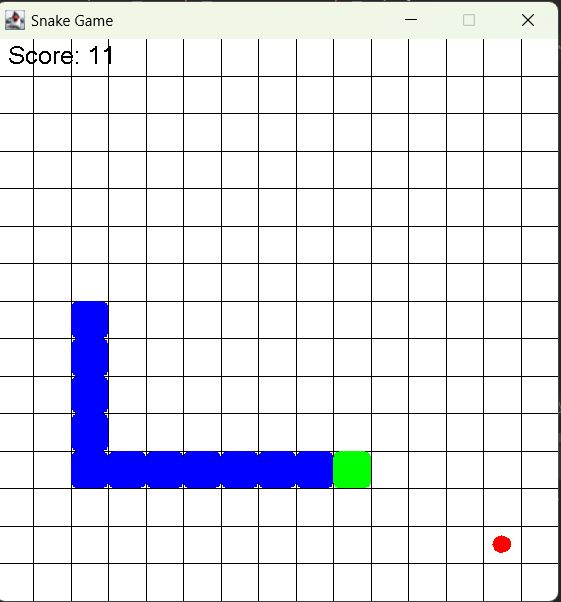

# SnakeGame

This is a simple snake game. the purpose of the game is for the snake to eat food items that appear randomly(the red circle) on the grid, which causes the snake to grow longer each time it consumes the food. The controls for the snake is the arrows found on the keyboard.

As the snake eats food and grows longer, the game becomes more challenging because the player must navigate the snake without running into itself. If the snake collides with itself, the game ends.

